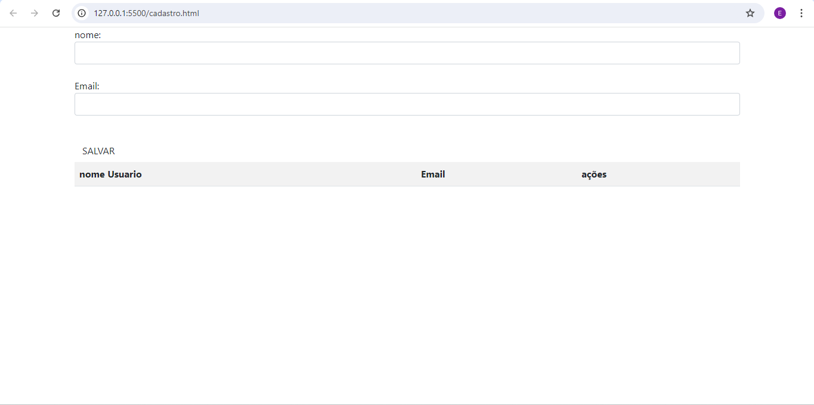
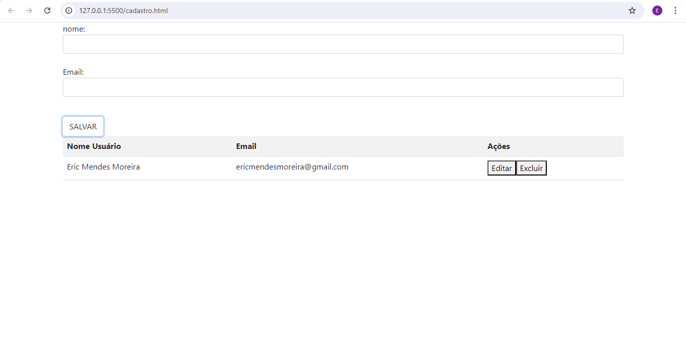

# Cadastro

## Imagens do projeto (cadastro) 

## Imagem do projeto (Login)

## Atualizações do Projeto

### Adição do Campo de Email e os códigos de validação
Pra que o códigos ficasse mais completo, foi adcionada a meta de adcionar o Email 
ao projeto, e também pedido que o Email só seria válido se estivesse escrito de maneira correta,  
no Js foi nessessário a criação de mais uma várialvel (emailLista), foi preciso mexer na função de editar e 
excluir, pois se o email é informado junto ao nome os dois precisam ser editaveis e excluiveis, e assim foi feito, 
para a validação utilizamos um códigos já feito antes (no repositório de validações) e também tinha que ser encaixado 
perfeitamente alinhado ao código, caso o contrário não funcionária, o código de válidação verifica se havia espaços, arroba e ponto, se não tivesse nãio seria aceito.

## Códigos de JavaScript utilizados
Para que este código funcionasse foram utilizadas as seguintes funções

### window.location.href
É utilizado na parte de JS do login, é utilizado para linkar a página 
de login com a de cadastro, após preencher todos os campos e apertar para acessar.

### Push
Utilizada a função na parte de cadastro aonde salva o nome informado, 
essa função serve para "empurrar" o nome escrito para a tabela da lista de nomes, 
acompanhado do nome da tabela aonde será enviado o nome escrito no espaço.

### Splice
Também presente nos códigos do JS, ele tem a função de alterar a tabela e adicionar 
o nome salvo.

### deleteRow
Essa função apaga uma certa linha escrita pertencente a tabela.

### getElementById
Pega o elemnto referenciado pelo ID indicado nos parenteses da função.

### indexOf
 retorna o primeiro índice em que o elemento pode ser encontrado no array, 
  retorna -1 caso o mesmo não esteja presente

# Tecnologias utilizadas 
*`HTML5` 
*`CSS3` 
*`Git` 
*`Github` 
*`Javascript` 
*`Bootstrap5` 

## Ferramentas utilizadas 
* `VScode` 

## fontes utilizadas para documentação
[Mozilla](https://developer.mozilla.org/en-US/docs/Web/JavaScript)

## Linkedin do desenvolvedor
[Meu perfil no linkedin](https://www.linkedin.com/in/eric-mendes-moreira-b5a49b301/)
